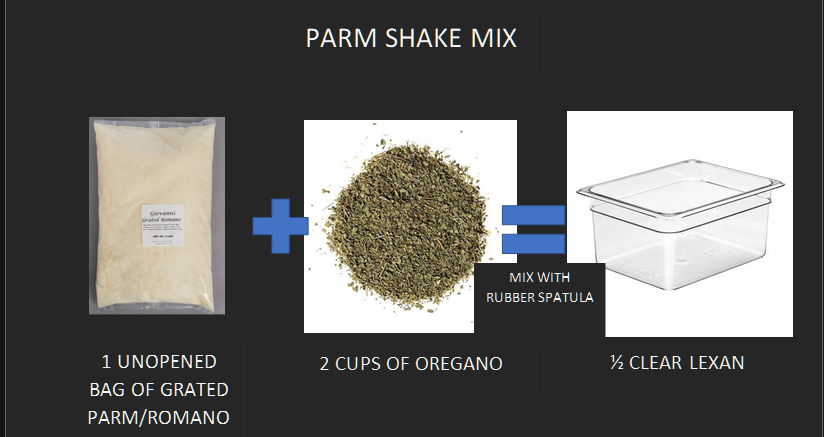

## Ingredients

- 1 bag of grated Parm/Romano
- 2 Cups of Oregano

## Instructions

1. Combine the Parm/Romano with the Oregano in a 1/2 clear lexan
2. Place lid on lexan and put label with date on the side