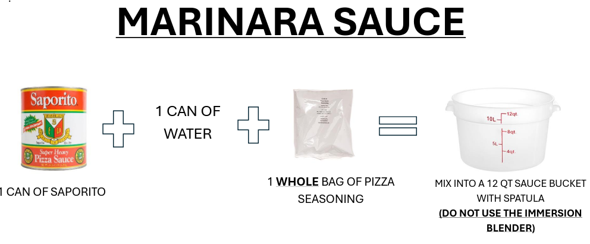

## Ingredients

- 1 can of Saporito
- 1 can of water
- 1 whole bag of pizza seasoning

## Instructions

1. Combine the Saporito and water.
2. Add the full bag of pizza seasoning.
3. Mix into a 12 qt sauce bucket with a spatula.
4. Do not use the immersion blender.