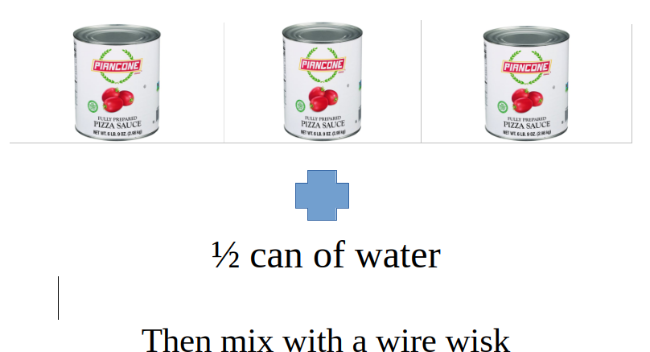

## Ingredients

- 3 cans of Piancone Fully Prepare Pizza Sauce
- 1/2 can of water

## Instructions

1. Put all ingredients in a 12 qt sauce bucket
2. Mix with a wire whisk
3. Place lid on sauce bucket, then place label on side of bucket with date and put in the walkin cooler
