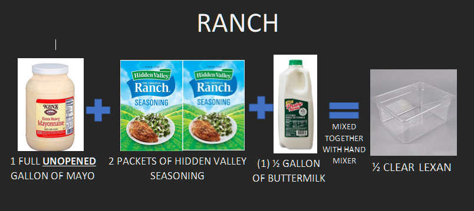

## Instructions

1. Pour 1 full unopened gallon of mayo into a 1/2 Lexan.
2. Pour 2 packets of Hidden Valley Seasoning into the Lexan.
3. Pour 1/2 gallon of buttermilk into the Lexan.
4. Mix together well with a hand-mixer.
5. Label the Lexan.
6. Place Lexan into the walk-in.
